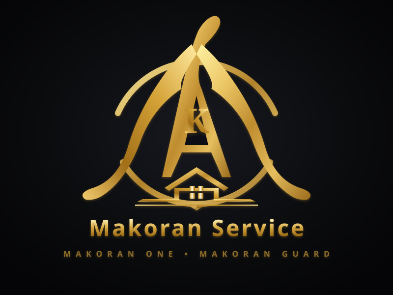

# MAKORAN ONE — پلتفرم ابری امنیت هوشمند و نظارت تصویری
## محصول تجاری: MAKORAN GUARD (مکران گارد)

<p align="center">
  
</p>

<p align="center">
  <strong>Server-Centric AI Intelligence • On-Demand WebRTC Video • Linux Mini PC Agent Gateway</strong>
</p>

---

## 🌟 ۱. چشم‌انداز پلتفرم (Product Vision)

**مکران وان (Makoran One)** یک پلتفرم چندمستأجره (Multi-Tenant SaaS) در مقیاس صنعتی برای مدیریت یکپارچه موارد زیر است:
- دوربین‌های مداربسته (CCTV)، دستگاه‌های DVR/NVR و دوربین‌های تحت شبکه (IP Cameras)
- امنیت هوشمند و سامانه اعلام سرقت و نفوذ (Smart Security & Alarm)
- تشخیص انسان (Human Detection)، تشخیص چهره (Face Detection & Recognition)
- طبقه‌بندی خودروها (Vehicle Detection) و پلاک‌خوان هوشمند (License Plate Recognition - LPR)
- استریم ویدئویی زنده بر اساس تقاضا (On-Demand WebRTC Live Video)
- مدیریت رویدادها، ارسال نوتیفیکیشن‌های Push، پیامک (SMS) و تماس‌های صوتی خودکار (Automated Phone Calls)
- سامانه حضور و غیاب پرسنل مبتنی بر چهره (Face Attendance)
- اتوماسیون ساختمان و مدیریت تاسیسات هوشمند (Facility Management & Building Automation)
- پورتال مشتریان، مدیریت دستگاه‌ها (CRM)، صدور فاکتور و اشتراک سازمانی (SaaS Billing)
- فروشگاه آنلاین خرید تجهیزات سخت‌افزاری (E-Commerce Store)

محصول تجاری ویژه امنیت این پلتفرم با نام **مکران گارد (Makoran Guard)** عرضه می‌گردد.

---

## 🏛️ ۲. مهم‌ترین تصمیم معماری: سرورمحور بودن (Server-Centric Intelligence)

> **قانون قطعی مهندسی:**  
> کامپیوتر مینی‌پی‌سی مشتری (Mini PC نظیر Intel N100 / N95) پردازشگر هوش مصنوعی نیست!  
> **مینی‌پی‌سی فقط گیت‌وی ارتباطی و امنیتی (Gateway) است و سرور، مغز متفکر سامانه (Brain) است.**

```
DVR / NVR / Cameras
        │
        ▼
   Mini PC (Intel N100 / N95)
  [MAKORAN AGENT / GATEWAY]
  (Capture + Connection + Upload + Execute Relay/Siren + On-Demand WebRTC)
        │
        │ Secure Outbound TLS Connection (No Static IP / No Port Forwarding Required)
        ▼
  [MAKORAN CLOUD BRAIN]
  (Server AI + Decision + Security Rule Engine + Events + Notifications + Multi-Tenancy)
```

---

## ⚡ ۳. قانون استریم زنده (No User Request = No Live Stream)

برای صرفه‌جویی ۱۰۰٪ در پهنای باند مشتری و جلوگیری از اشغال اینترنت در مناطق ساحلی و مکران:
- تا زمانی که کاربر دکمه **«مشاهده زنده»** را در پنل کلیک نکند، هیچ جریان ویدئویی پیوسته‌ای به ابر ارسال نمی‌شود.
- خط لوله WebRTC مستقیماً میان مرورگر کاربر و مینی‌پی‌سی برقرار می‌شود.
- به محض بستن صفحه یا زدن دکمه توقف، استریم ویدئویی متوقف و کلیه منابع آزاد می‌گردد.

---

## 🚀 ۴. نحوه راه‌اندازی سریع (Quick Start)

### پیش‌نیازها:
- Node.js v20+ یا v22+
- npm v10+

### نصب و راه‌اندازی کل پلتفرم:
```bash
# نصب وابستگی‌ها
npm install

# ساخت کلاینت فرانت‌اند
npm run build

# اجرای همزمان سرور ابری (Brain) و ایجنت مینی‌پی‌سی (Agent)
npx tsx start-makoran.ts
```

سامانه روی آدرس `http://0.0.0.0:3000` دردسترس خواهد بود.

---

## 🔐 ۵. اطلاعات حساب کاربری پیش‌فرض

* **پست الکترونیکی:** `admin@makoran.io`
* **رمز عبور:** `MakoranGuard2026!`
* **نقش کاربری:** `SUPERADMIN`
* **سازمان:** `مکران گارد سنترال (Makoran Central Guard - Enterprise Plan)`

---

## 🧪 ۶. مجموعه آزمون‌های خودکار یکپارچگی (Automated Test Suites)

اجرای کلیه آزمون‌های خودکار پلتفرم:
```bash
npm test
```
این دستور به‌صورت متوالی ۷ مجموعه تست جامع را با خروجی ۱۰۰٪ موفق اجرا می‌کند:
1. **Vertical Slice E2E Test (`tests/vertical-slice.test.mjs`)**: اعتبارسنجی کامل ۱۰ مرحله‌ای جریان سیستم از مینی‌پی‌سی تا کلاود، هوش مصنوعی، صدور آژیر، فعال‌سازی رله، پیامک/تماس و استریم WebRTC On-Demand.
2. **Multi-Tenancy Isolation Test (`tests/multi-tenancy.test.mjs`)**: تضمین عدم نشت داده میان سازمان‌ها و ایزولاسیون کامل دیتابیس در لایه SQL.
3. **AI Priority Queue Scheduling Test (`tests/ai-priority.test.mjs`)**: اعتبارسنجی اولویت‌بندی بلادرنگ درخواست‌های AI با صف اولویت ۴ سطحی (`CRITICAL`, `HIGH`, `NORMAL`, `LOW`).
4. **Security Rule Engine Test (`tests/rule-engine.test.mjs`)**: تست ارزیابی منطقی شرایط، زون‌ها، وضعیت‌های مسلح و جدول زمان‌بندی قوانین امنیتی.
5. **Camera WS-Discovery & RTSP Probe Test (`tests/camera-discovery.test.mjs`)**: کشف خودکار تجهیزات Dahua, Hikvision, XMeye و NVRهای شبکه محلی.
6. **Commercial SaaS Features Suite (`tests/saas-features.test.mjs`)**: اعتبارسنجی حضور و غیاب بیومتریک، اتوماسیون ساختمان، صدور سفارشات فروشگاه، مدیریت چندمستأجری، لاگ‌های غیرقابل‌دستکاری و ارتقای RBAC.
7. **Enterprise Scale & Security Operations Suite (`tests/enterprise-scale.test.mjs`)**: اعتبارسنجی ۹ مرحله‌ای شامل: چرخه کامل تیکت‌ها و اعزام گشت حراست، دفتر الکترونیک ثبت تحویل و تحول شیفت‌ها، چک‌پوینت‌های نظارتی گشت، تهیه نسخه پشتیبان رمزنگاری‌شده فاجعه (Disaster Recovery Snapshot)، پخش زنده پیام صوتی بازدارنده روی بلندگوی محیطی مینی‌پی‌سی و اعتبارسنجی مشخصات قرارداد OpenAPI 3.0.

---

## 📡 ۷. مستندات تعاملی API (OpenAPI 3.0 Specification)

سند رسمی قراردادهای وب‌سرویس پلتفرم بر روی اندپوینت اختصاصی کلاود در دسترس است:
- **اندپوینت مستندات:** `GET /api/v1/docs`
- **پروتکل:** OpenAPI 3.0.3 با ۳۶ اندپوینت استاندارد سازمانی
- **تگ‌های عملیاتی:** Core & Health، Auth & RBAC، Guard Alarm، AI Gateway، On-Demand WebRTC، Edge Agents، Incidents & Patrols، و Disaster Recovery.

---

## 📦 ۸. استقرار با داکر (Docker Deployment)

```bash
docker-compose up -d --build
```

---

## 📂 ۹. ساختار پوشه‌ها و ماژول‌ها

```
makoran-one/
├── server/          # هسته سرور ابری، هوش مصنوعی، قوانین و دیتابیس
├── agent/           # ایجنت لینوکس مینی‌پی‌سی، آداپتورهای دوربین و رله
├── client/          # رابط کاربری وب و موبایل واکنش‌گرا با برندینگ مکران
├── shared/          # تایپ‌ها و قراردادهای مشترک (AI Contract v1)
├── assets/          # وکتورهای لوگوی زرین اختصاصی مکران سرویس
├── tests/           # تست‌های خودکار یکپارچگی
├── docker-compose.yml
└── start-makoran.ts # اسکریپت اجرای همزمان محیط یکپارچه
```

---

© 2026 Makoran One & Makoran Guard — All Rights Reserved.
